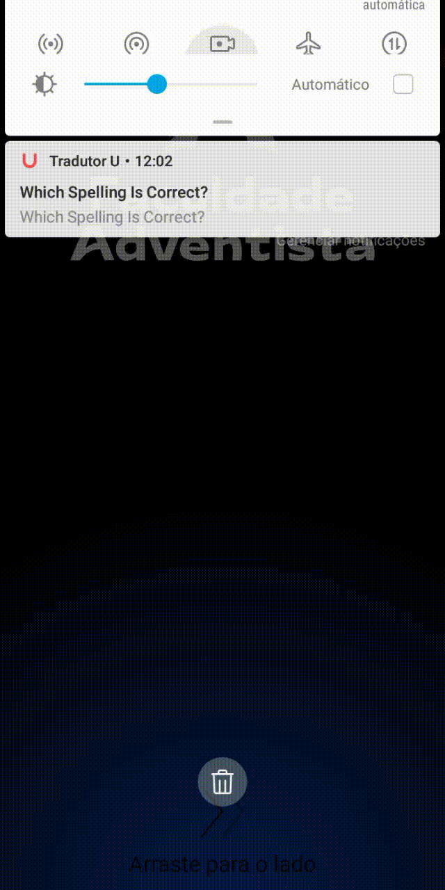
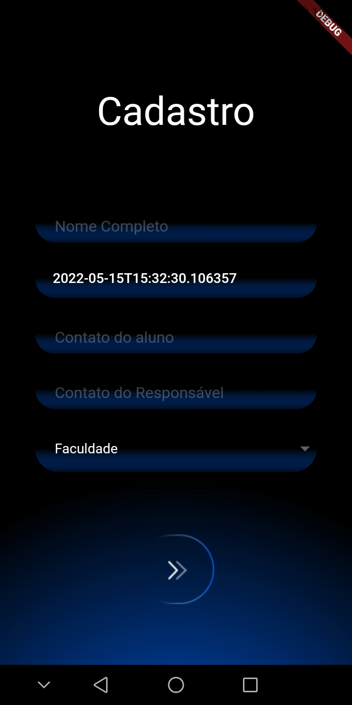
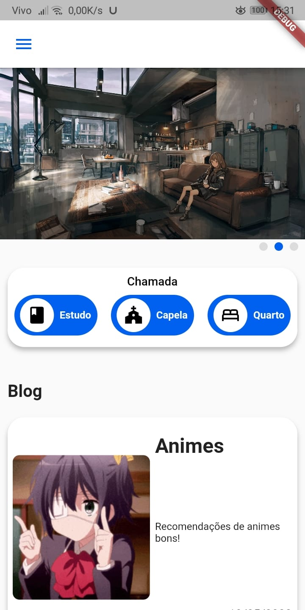

# Projeto faculdade

Projeto Faculdade

 -
<a href="#features">Features</a> -
<a href="#autor">Autor</a> -
<a href="#preview">Preview</a> -
<a href="#tecnologias">Tecnologias</a> -
<a href="#autor">Autor</a> -
<a href="#version">Version</a> -

---
 

<h4 align="center">🏗️ PROJETO EM ANDAMENTO 🏗️</h4>

# Sobre

Aplicativo para o evento

 

# Features
- [x] Login Screen
- [x] SignUp Screen
- [ ] User System
- [ ] Main Screen
  - [x] Caroseul
  - [ ] Blog
- [ ] Adm Screen
  - [ ] Add Image in Caroseul
  - [ ] Creat Post in Blog
  - [ ] Creat event
  - [ ] List User
  - [ ] Add admin
  - [ ] Log 
- [ ] Calendar Screen
- [ ] Perfil Screen
  - [ ] QrCode create
  - [ ] QrCode Scanner

 

# Preview

# Tecnologias

- Flutter
  - Cupertino_icons:
  - carousel_slider:
  - smooth_page_indicator:
  - camera:
  - path_provider:
  - path:
  - flutter_native_splash: ^2.1.6
  - flutter_launcher_icons: ^0.9.2
  
 

# Autor
<pre>
Anderson 
  ଲ( ⓛ ω ⓛ *)ଲ
</pre>
<pre>
Adriel
  ଲ( ⓛ ω ⓛ *)ଲ 
</pre>
<pre>
Romulo 
  ଲ( ⓛ ω ⓛ *)ଲ 
</pre>
<pre>
João
  ଲ( ⓛ ω ⓛ *)ଲ 
</pre>
<pre>
Lucas
  ଲ( ⓛ ω ⓛ *)ଲ 
</pre>

 

# Version
- Version 0.1.2

